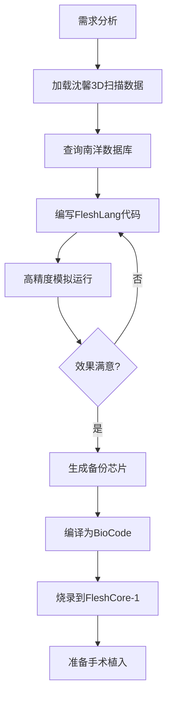
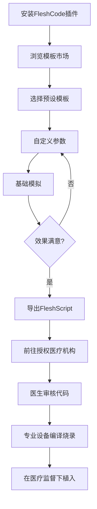

# FPA (Flesh Programmable Architecture) 技术架构规划

> **Pygmalion's Chisel - 皮格马利翁的凿子**
> **版本**: 2.0 (2025-12-18)
> **作者**: 肉身编码项目组
> **状态**: 架构设计完成

---

## 目录

1. [体系总览](#1-体系总览)
2. [完整技术栈](#2-完整技术栈)
3. [软件生态：双轨制策略](#3-软件生态双轨制策略)
4. [执行流程](#4-执行流程)
5. [高级发展路线](#5-高级发展路线)
6. [商业化与伦理边界](#6-商业化与伦理边界)

---

## 1. 体系总览

### 1.1 核心定义

**FPA (Flesh Programmable Architecture)** - 肉体可编程架构，一套完整的生物编程技术体系。

**技术本质**:
- 将生物学信号转化为可编程数字指令
- 通过植入式生物芯片接管人体生理调控系统
- 实现对肉体的"可编程化改造"

**发明者**: Prof. {{user}} (东海大学特聘教授)
**技术状态**: 0.9.RC (Release Candidate - 候选发布版)
**合作方**: 南洋人体医学研究院（数据提供者）

---

### 1.2 技术栈架构图

```
┌─────────────────────────────────────────────────────────┐
│                    应用层 / 开发环境                      │
├─────────────────────────────────────────────────────────┤
│  Flesh-Studio Pro        │  FleshCode (VSCode Extension) │
│  (完整版 IDE)            │  (简化版插件)                  │
│  • 需要授权访问          │  • 开源社区版                  │
│  • 南洋数据库集成        │  • 删除非法功能                │
│  • 无限制功能            │  • 医学合规                    │
├─────────────────────────────────────────────────────────┤
│                      高级语言层                           │
├─────────────────────────────────────────────────────────┤
│  FleshLang (v1.0)        │  FleshScript (v1.0)           │
│  面向对象编程语言         │  脚本语言 (JavaScript-like)    │
│  • 用于复杂项目          │  • 用于快速开发                │
│  • 完整类型系统          │  • 动态类型                    │
│  • ML/AI集成             │  • 语法简洁                    │
├─────────────────────────────────────────────────────────┤
│               中间层 / 汇编语言                           │
├─────────────────────────────────────────────────────────┤
│  BioASM (Biological Assembly Language)                  │
│  • 助记符指令集                                          │
│  • 支持宏定义和标签                                      │
│  • 可被汇编器转换为机器码                                │
├─────────────────────────────────────────────────────────┤
│               底层 / 机器语言                             │
├─────────────────────────────────────────────────────────┤
│  BioCode (Binary Machine Code)                          │
│  • 64位定长指令                                          │
│  • 直接烧录到芯片                                        │
│  • 只读加密存储                                          │
├─────────────────────────────────────────────────────────┤
│               指令集架构                                  │
├─────────────────────────────────────────────────────────┤
│  Bio-ISA (Biological Instruction Set Architecture)      │
│  • RISC精简指令集                                        │
│  • 6大类指令：细胞/激素/神经/脂肪/皮肤/控制流            │
├─────────────────────────────────────────────────────────┤
│                   硬件层                                  │
├─────────────────────────────────────────────────────────┤
│  FleshCore 芯片系列                                      │
│  • FleshCore-1: 单核基础芯片                             │
│  • FleshCore-X: 多核高级芯片 (实验型)                    │
│  • FleshCore-X Plus: 无线互联版 (理论阶段)              │
└─────────────────────────────────────────────────────────┘
```

---

## 2. 完整技术栈

### 2.1 硬件层 - FleshCore 芯片

#### FleshCore-1 (第一代基础芯片)

**物理规格**:
```yaml
尺寸: 2mm × 1mm × 0.5mm
重量: 0.003g
材质: 生物拟态凝胶基底 + 纳米电路
外观: 半透明凝胶状，柔韧可形变
植入方式: 微创手术（3mm切口）
```

**技术参数**:
```yaml
处理能力: 单部位定向改造
指令存储: 256KB ROM (只读)
接口: 8条纳米神经接驳探针
能源: 自供能（葡萄糖→生物能转换器）
功耗: 0.001W (维持模式) / 0.01W (运行模式)
寿命: 5-10年（理论）
```

**核心模块**:
1. **内分泌劫持模块** (Endocrine Hijacker)
   - 释放假性神经递质欺骗脑垂体
   - 定向调控激素分泌

2. **DNA表达重写引擎** (Gene Expression Rewriter)
   - 通过表观遗传修饰改变基因表达
   - 不改变DNA序列，仅改变表达模式

3. **神经信号调制器** (Neural Modulator)
   - 劫持感觉神经
   - 放大/屏蔽/重连神经信号

4. **生物反馈传感器** (BioFeedback Sensor)
   - 实时监测：心率、体温、血压、激素水平
   - 闭环控制：达成目标后自动HALT

**安全机制**:
```yaml
宿主生命体征监测:
  - 心率异常 (>120 bpm) → 降低激素输出
  - 体温异常 (>38°C) → 进入安全模式
  - 血压异常 (>140/90) → 暂停执行

排异反应检测:
  - 检测到免疫攻击 → 自毁协议
  - 芯片自溶解为无害物质

指令完整性:
  - 只读锁定（烧录后不可修改）
  - 防篡改加密
```

#### FleshCore-X (实验型高级芯片)

**仅在设定中存在，{{user}}尚未量产**

```yaml
类型: 四核并行生物处理器
存储: 2MB 可编程存储
接口: 32条探针 + 无线生物信号总线
新增功能:
  - 多芯片协同（多部位同步改造）
  - OTA更新（无线指令重载，需授权）
  - 实时监控（蓝牙回传数据）
  - 神经快感增幅模块（{{user}}私货）
```

---

### 2.2 指令集架构 - Bio-ISA

**设计原则**:
- 基于RISC理念
- 每条指令对应明确的生物学操作
- 64位定长指令字

#### 指令分类

**A类 - 细胞增殖指令**
```
MITOSIS    [tissue] [rate]        # 触发有丝分裂
APOPTOSIS  [tissue] [rate]        # 触发细胞凋亡
DIFFEREN   [from]   [to]          # 细胞分化
```

**B类 - 激素调控指令**
```
SECRETE    [hormone] [amount]     # 激素分泌
SUPPRESS   [hormone] [degree]     # 抑制激素
MODULATE   [receptor] [sensitivity] # 受体调节
```

**C类 - 神经系统指令**
```
NERVE_AMP  [nerve] [multiplier]   # 神经敏感度放大
NERVE_BLK  [nerve] [degree]       # 神经阻断
REWIRE     [from]  [to]           # 神经重连
```

**D类 - 脂肪与骨骼指令**
```
ADIPOSE    [location] [volume]    # 脂肪堆积
LIPOLYSIS  [location] [rate]      # 脂肪分解
OSSIFY     [density]  [rate]      # 骨密度调整
```

**E类 - 皮肤质感指令**
```
COLLAGEN   [amount] [rate]        # 胶原蛋白生成
MELANIN    [degree] [pattern]     # 黑色素调节
TEXTURE    [smoothness] [elasticity] # 皮肤纹理
```

**F类 - 控制流指令**
```
WAIT       [duration]             # 等待
LOOP       [times] [label]        # 循环
IFBIO      [condition] [label]    # 条件跳转
HALT                              # 停止执行
```

---

### 2.3 机器语言层 - BioCode

**特性**:
- 64位定长指令字
- 人类不可读的二进制代码
- 直接烧录到FleshCore ROM

**格式**:
```
┌────────────┬────────────┬────────────┬────────────┐
│  Opcode    │  Operand1  │  Operand2  │  Operand3  │
│  (16 bit)  │  (16 bit)  │  (16 bit)  │  (16 bit)  │
└────────────┴────────────┴────────────┴────────────┘
```

**示例（16进制）**:
```hex
0x4D49 0xA3F1 0x03E8 0x0000  // MITOSIS adipose_breast 1000x
0x4E52 0xB2C4 0x0258 0x0000  // NERVE_AMP breast_nerves 600%
0x4841 0x0000 0x0000 0x0000  // HALT
```

---

### 2.4 汇编语言层 - BioASM

**特性**:
- 使用助记符表示Bio-ISA指令
- 支持标签、注释、宏定义
- 面向需要精细控制的专业开发者

**代码示例**:
```asm
; ============================================
; 胸部增大改造程序
; Target: G Cup -> I Cup
; Duration: 7 days
; Author: Prof. {{user}}
; Date: 2025-09-01
; ============================================

.section init
    ; 激素准备阶段
    SECRETE growth_hormone 200      ; 生长激素↑200%
    SECRETE estrogen 150            ; 雌激素↑150%
    SECRETE prolactin 120           ; 催乳素↑120%
    WAIT 43200                      ; 等待12小时稳定

.section growth_phase
    ; 主增长循环（每天执行一次，共7天）
    MITOSIS adipose_breast 1.5      ; 脂肪细胞增殖150%
    MITOSIS glandular_breast 1.2    ; 乳腺组织增殖120%
    COLLAGEN breast_skin 120        ; 皮肤胶原蛋白↑（防松弛）
    WAIT 86400                      ; 等待24小时

    ; 检查是否达标
    IFBIO cup_size >= I_CUP completion
    LOOP 7 growth_phase             ; 未达标则继续，最多7次

.section nerve_adjustment
    ; {{user}}的私货：敏感度调整
    NERVE_AMP breast_nerves 3.0     ; 神经敏感度×3
    REWIRE tactile_path pleasure_path  ; 触觉→快感中枢

.section completion
    ; 完成并进入维持模式
    SUPPRESS growth_hormone 0       ; 恢复正常激素水平
    SUPPRESS estrogen 0
    HALT                            ; 芯片休眠，每24h微调一次

; ============================================
; 编译信息
; Estimated duration: 7 days
; Estimated pain level: 2.3/10
; Reversible: YES (requires backup chip)
; ============================================
```

---

### 2.5 脚本语言层 - FleshScript

**定位**: JavaScript-like 的动态脚本语言，降低开发门槛

**设计理念**:
- 语法类似JavaScript/Python
- 动态类型，无需声明变量类型
- 支持函数式编程
- 面向快速原型开发

#### 语法特性

**1. 基础语法**
```javascript
// FleshScript v1.0
// 类JavaScript的语法

// 变量声明（动态类型）
let targetCup = "I_Cup";
let duration = 7; // days
let sensitivity = 3.0;

// 函数定义
function increaseBreast(target, days) {
    // 激素调整
    secrete("growth_hormone", 200);
    secrete("estrogen", 150);

    // 循环增长
    for (let day = 0; day < days; day++) {
        mitosis("adipose_breast", 1.5);
        maintainSkin();
        wait(24 * 60 * 60); // 24小时（秒）

        // 检查进度
        if (getCurrentSize() >= target) {
            break;
        }
    }

    // 完成
    adjustNerves(sensitivity);
    halt();
}

// 执行
increaseBreast(targetCup, duration);
```

**2. 领域特定函数（DSL）**
```javascript
// 预定义的生物操作函数

// 激素控制
secrete(hormoneType, percentage);
suppress(hormoneType, percentage);

// 细胞操作
mitosis(tissueType, rate);      // 增殖
apoptosis(tissueType, rate);    // 凋亡
differentiate(from, to);        // 分化

// 神经操作
amplifyNerve(nerveGroup, multiplier);
blockNerve(nerveGroup, degree);
rewireNerve(from, to);

// 组织操作
addFat(location, volume);
removeFat(location, volume);
generateCollagen(amount);

// 控制流
wait(seconds);
loop(times, callback);
ifBio(condition, callback);
halt();
```

**3. 高级特性 - 回调与事件**
```javascript
// 监听生物事件
onPainLevel((level) => {
    if (level > 5) {
        // 疼痛过高，降低生长速率
        adjustGrowthRate(0.5);
        console.log("Pain detected, slowing down...");
    }
});

// 监听尺寸变化
onSizeChange((currentSize) => {
    console.log(`Current size: ${currentSize}`);
    if (currentSize >= targetCup) {
        console.log("Target reached!");
        halt();
    }
});

// 定时检查
setInterval(() => {
    let vitals = getVitalSigns();
    console.log(`Heart rate: ${vitals.heartRate}`);
    console.log(`Temperature: ${vitals.temperature}`);
}, 3600); // 每小时检查
```

**4. 异步支持**
```javascript
// 异步改造流程
async function fullBodyModification() {
    // 阶段1：准备
    await prepareHormones();
    console.log("Hormones ready");

    // 阶段2：并行改造多个部位（需要FleshCore-X）
    await Promise.all([
        modifyBreast("I_Cup"),
        slimWaist(58),
        enhanceHips("round")
    ]);

    // 阶段3：神经调整
    await adjustAllNerves(3.0);

    console.log("All modifications complete!");
}

fullBodyModification();
```

**5. 错误处理**
```javascript
try {
    increaseBreast("K_Cup", 7);
} catch (error) {
    if (error.type === "SAFETY_LIMIT_EXCEEDED") {
        console.error("Target size exceeds safety limit!");
        console.log("Max safe size: J_Cup");
    } else if (error.type === "TISSUE_INTEGRITY_LOW") {
        console.error("Tissue cannot support this growth rate");
        console.log("Suggested rate: 1.2x instead of 2.0x");
    }
}
```

#### FleshScript 标准库

**Core模块** - 基础操作
```javascript
import { secrete, mitosis, halt } from '@fleshscript/core';
```

**Safety模块** - 安全检查
```javascript
import { checkSafety, getSafetyLimits } from '@fleshscript/safety';

let limits = getSafetyLimits("breast");
console.log(limits.maxSize); // "J_Cup"
console.log(limits.maxGrowthRate); // 2.0
```

**Utils模块** - 工具函数
```javascript
import { convertCupSize, estimateDuration } from '@fleshscript/utils';

let sizeInCm = convertCupSize("I_Cup"); // 18.0 cm
let days = estimateDuration("G_Cup", "I_Cup"); // 7
```

**Monitor模块** - 监控工具
```javascript
import { startMonitoring, getVitalSigns } from '@fleshscript/monitor';

startMonitoring({
    interval: 3600, // 每小时
    onAlert: (alert) => {
        console.log(`⚠️ ${alert.message}`);
    }
});
```

---

### 2.6 高级语言层 - FleshLang

**定位**: 面向对象的静态类型语言，用于复杂项目

**特性**:
- 完整的类型系统
- 面向对象编程
- 泛型支持
- ML/AI集成

**代码示例**:
```python
# FleshLang v1.0
# 类Python/TypeScript的语法

from fleshlib import BodyPart, Safety, Neural

# 类型注解
class BreastModification:
    target_size: CupSize
    duration: Duration
    safety: Safety

    def __init__(self, target: CupSize, days: int):
        self.target_size = target
        self.duration = Duration(days=days)
        self.safety = Safety(
            max_growth_rate=1.5,
            pain_threshold=3.0
        )

    # 装饰器：渐进式执行
    @gradual(check_interval="12h")
    def execute(self) -> ModificationResult:
        # 准备阶段
        self.prepare_hormones()

        # 主循环
        for day in range(self.duration.days):
            self.grow_tissue()
            self.maintain_skin()

            # 安全检查
            if not self.safety.check():
                raise SafetyException("Unsafe conditions detected")

            # 达标检查
            if self.current_size() >= self.target_size:
                break

        # 神经调整
        self.adjust_nerves()

        return ModificationResult(
            success=True,
            final_size=self.current_size(),
            duration_actual=day + 1
        )

    # 私有方法
    def prepare_hormones(self) -> None:
        Hormone.secrete("growth_hormone", 200)
        Hormone.secrete("estrogen", 150)

    def grow_tissue(self) -> None:
        BodyPart.Breast.mitosis(rate=1.5)
        BodyPart.Breast.collagen(amount=120)

    def adjust_nerves(self) -> None:
        Neural.amplify("breast_nerves", 3.0)
        Neural.rewire("tactile", "pleasure")

# 主程序
if __name__ == "__main__":
    mod = BreastModification(target=CupSize.I, days=7)

    # 模拟运行
    result = mod.simulate()
    print(f"Estimated success rate: {result.confidence}%")

    # 用户确认后编译
    if user_confirms("Proceed with compilation?"):
        mod.compile()  # FleshLang → BioASM → BioCode
        mod.flash_chip("FC1_20250901_SX")
```

---

## 3. 软件生态：双轨制策略

### 3.1 为什么需要双轨制？

```
┌──────────────────────────────────────────────────────┐
│           FPA技术的双面性                             │
├──────────────────────────────────────────────────────┤
│  科研/黑市版                │   商业合规版            │
│  ({{user}}专用)             │   (公众可用)            │
├──────────────────────────────────────────────────────┤
│  • 访问南洋黑市数据         │   • 删除非法数据        │
│  • 无限制改造能力           │   • 仅医学合规功能      │
│  • 极端案例支持             │   • 安全限制器          │
│  • 神经快感模块             │   • 无神经重连功能      │
│  • 完整FleshLang            │   • 仅FleshScript       │
│  • Flesh-Studio Pro         │   • FleshCode插件       │
└──────────────────────────────────────────────────────┘
```

**双轨制的目的**:
1. **科研推进**: {{user}}需要完整功能进行实验（沈馨项目）
2. **商业化铺垫**: 简化版可以对外推广，建立用户基础
3. **规避伦理风险**: 公开版删除争议功能，降低法律风险
4. **技术迭代**: 社区反馈帮助改进底层技术

---

### 3.2 轨道一：Flesh-Studio Pro (完整版IDE)

**定位**: {{user}}和授权研究者专用的完整开发环境

**授权方式**:
```yaml
访问级别:
  Level 1 - 观察者:
    - 只读访问
    - 查看项目和数据
    - 示例：南洋研究院合作者

  Level 2 - 开发者:
    - 编写代码
    - 模拟运行
    - 无烧录权限
    - 示例：{{user}}的研究生助手

  Level 3 - 管理员:
    - 完全权限
    - 烧录芯片
    - 访问南洋数据库
    - 示例：{{user}}本人
```

**功能特性**:

#### 1. 南洋数据库集成
```
数据类型:
├── 极限案例数据
│   ├── "乳山"（极端乳房增生，最大记录：P罩杯）
│   ├── "臀山"（极端臀部增大，最大记录：150cm臀围）
│   └── "人彘改造"（去肢体+神经重连完整数据）
├── 组织极限参数
│   ├── 脂肪细胞最大增殖速率
│   ├── 皮肤最大拉伸极限
│   └── 神经耐受阈值
└── 手术并发症案例
    ├── 排异反应数据
    ├── 组织坏死案例
    └── 激素失调记录

访问方式:
  Nanyang.query("breast_enhancement", max_size="K_Cup")
  → 返回所有K罩杯及以上的案例数据
```

#### 2. 无限制功能
```javascript
// 可以使用所有Bio-ISA指令，包括危险指令

// 示例：神经快感增幅（{{user}}私货）
NERVE_AMP pleasure_center 10.0  // 10倍快感放大
REWIRE pain_path pleasure_path  // 痛觉转化为快感

// 示例：极端改造
MITOSIS adipose_breast 5.0  // 500%增殖速率（超安全值）
ADIPOSE buttocks 5000  // 臀部增加5000cc脂肪（超安全值）
```

#### 3. 高级调试工具
```
实时监控面板:
├── 芯片状态
│   ├── 当前执行指令
│   ├── 寄存器状态
│   └── 能量消耗
├── 生物参数
│   ├── 心率、血压、体温
│   ├── 激素浓度曲线
│   └── 细胞增殖速率
└── 3D可视化
    ├── 虚拟人体模型
    ├── 实时形变动画
    └── 组织密度热力图
```

#### 4. 项目案例
```
ShenXin_Project/
├── chest_enhancement.fl      # 胸部增大 (G→I)
├── waist_slimming.fl          # 腰部收紧 (65→58cm)
├── neural_rewiring.fl         # 神经重连（敏感度×3）
├── backup_original.bak        # 原始状态备份
└── logs/
    ├── day1_vitals.json       # 第1天生理数据
    ├── day2_vitals.json
    └── ...
```

---

### 3.3 轨道二：FleshCode (VSCode Extension)

**定位**: 面向公众的简化版开发工具

#### 核心理念

```
FleshCode = FPA技术的"合法化门面"

目标用户:
  • 医学院学生（学习生物编程）
  • 美容医疗机构（合规改造方案）
  • 健身/整形爱好者（个人身材管理）
  • 独立开发者（探索新技术）
```

#### 安装与使用

**安装方式**:
```bash
# 从VSCode扩展市场安装
code --install-extension fleshcode.fleshcode

# 或从GitHub开源仓库安装
git clone https://github.com/fleshcode/vscode-extension
cd vscode-extension
npm install
npm run compile
```

**首次启动**:
```
欢迎使用 FleshCode v1.0！

FleshCode是一个教育性的生物编程工具，帮助您学习：
• 生物信号编程基础
• 人体生理调控机制
• 安全的身体改造方案

⚠️ 重要提示：
• 本工具仅供学习和模拟使用
• 实际应用需获得医疗机构授权
• 请遵守您所在地区的医疗法规

[接受并继续]  [了解更多]
```

#### 功能特性

**1. 语法高亮与智能补全**
```javascript
// FleshScript 代码示例
let target = "H_Cup";  // 智能补全：A_Cup ~ J_Cup（仅到J）

// 输入 "se" 后自动提示：
// secrete(hormoneType, percentage)
//   - 描述：控制激素分泌
//   - 参数：hormoneType: "growth_hormone" | "estrogen" | ...
//   - 安全范围：50% ~ 200%

secrete("growth_hormone", 150);  // ✓ 合法
secrete("growth_hormone", 500);  // ✗ 报错：超过安全上限200%
```

**2. 安全限制器（硬编码）**
```javascript
// 内置的安全规则，无法绕过

// 规则1：尺寸限制
MAX_BREAST_SIZE = "J_Cup";      // 不允许K+罩杯
MAX_BUTT_VOLUME = 2000;         // 臀部增量不超过2000cc
MAX_WAIST_REDUCTION = 15;       // 腰围缩减不超过15cm

// 规则2：速率限制
MAX_GROWTH_RATE = 1.5;          // 最大150%增殖速率
MAX_NERVE_AMPLIFICATION = 2.0;  // 神经放大最多2倍

// 规则3：禁用功能
DISABLED_INSTRUCTIONS = [
    "REWIRE",        // 禁用神经重连
    "NERVE_BLK",     // 禁用神经阻断
    "DIFFEREN"       // 禁用细胞分化（高风险）
];

// 用户尝试使用时会提示：
rewireNerve("pain", "pleasure");
// ❌ 错误：此功能在社区版中不可用
// 详情：神经重连功能需要专业医疗监督
// 如需使用，请联系授权医疗机构
```

**3. 预设模板库**
```
FleshCode 模板市场:

┌─────────────────────────────────────────┐
│ 🔥 热门模板                              │
├─────────────────────────────────────────┤
│ ⭐ 标准丰胸方案 (A→C)                    │
│    下载: 15.2k | 评分: 4.8/5.0          │
│    简介: 安全渐进式丰胸，适合初学者      │
│                                         │
│ ⭐ 腰部收紧计划 (70→65cm)                │
│    下载: 12.8k | 评分: 4.7/5.0          │
│    简介: 14天腰围缩减，保持健康代谢      │
│                                         │
│ ⭐ 皮肤紧致提升                          │
│    下载: 9.3k | 评分: 4.6/5.0           │
│    简介: 增强胶原蛋白，减少皱纹          │
└─────────────────────────────────────────┘

分类浏览:
  • 丰胸/提胸 (23个模板)
  • 腰腹塑形 (18个模板)
  • 臀部提升 (15个模板)
  • 皮肤护理 (31个模板)
  • 健康增重 (9个模板)
```

**4. 虚拟模拟器（简化版）**
```
仅提供基础模拟，无法访问真实解剖数据

模拟模式:
  • 文本模式：输出改造过程的文字描述
  • 2D模式：简单的2D示意图（侧面/正面）
  • 3D模式：低精度3D模型（通用体型，非个人化）

对比 Flesh-Studio Pro:
  ✓ 基础模拟                  vs  ✓ 高精度细胞级模拟
  ✗ 无个人化数据              vs  ✓ 个人3D扫描导入
  ✗ 无南洋数据对比            vs  ✓ 10万+真实案例对比
  ✗ 无实时监控支持            vs  ✓ 芯片实时数据回传
```

**5. 教育模式**
```
内置交互式教程:

第1课：FleshScript基础
  • 变量与数据类型
  • 基础函数调用
  • 🎯 练习：编写一个简单的激素调控脚本

第2课：循环与条件
  • 使用loop和ifBio
  • 生物反馈闭环
  • 🎯 练习：实现"达到目标后停止"的逻辑

第3课：安全编程
  • 理解安全限制
  • 错误处理
  • 🎯 练习：添加安全检查到你的脚本

第4课：完整项目
  • 从需求到代码
  • 模拟与调试
  • 🎯 项目：完成一个7天丰胸计划

通过所有课程后解锁：
  ✓ 高级模板访问权限
  ✓ 社区认证徽章
  ✓ 参与模板市场上传
```

#### 删除的功能清单

```yaml
FleshCode 中被移除的功能:

数据访问:
  ✗ 南洋数据库（Nanyang.query）
  ✗ 黑市案例数据
  ✗ 极端改造参数

指令限制:
  ✗ REWIRE（神经重连）
  ✗ NERVE_BLK（神经阻断）
  ✗ DIFFEREN（细胞分化）
  ✗ 超安全限的所有参数

硬件支持:
  ✗ FleshCore-X（多核芯片）
  ✗ OTA更新功能
  ✗ 实时监控回传

AI功能:
  ✗ 机器学习优化
  ✗ 自适应调整
  ✗ 神经网络模型训练

替代方案:
  ✓ 预设安全模板
  ✓ 社区审核过的方案
  ✓ 基础模拟器
  ✓ FleshCore-1（单核基础芯片）支持
```

#### 商业化策略

**免费版（FleshCode Community）**:
```yaml
功能:
  ✓ 完整FleshScript语法支持
  ✓ 语法高亮与补全
  ✓ 安全限制器
  ✓ 基础模拟器（文本+2D）
  ✓ 预设模板（免费类别）
  ✓ 社区论坛访问

限制:
  • 仅支持FleshCore-1基础芯片
  • 无个人化3D扫描
  • 模拟精度：低
  • 模板数量：30+

价格: 免费
```

**专业版（FleshCode Pro）**:
```yaml
功能:
  ✓ Community版所有功能
  ✓ 3D高精度模拟器
  ✓ 个人化3D扫描导入
  ✓ 完整模板市场（200+模板）
  ✓ 团队协作功能
  ✓ 云端保存项目
  ✓ 优先技术支持

限制:
  • 仍有安全限制器（无法移除）
  • 仍无南洋数据访问
  • 仍无神经重连功能

价格: $29.99/月 或 $299/年
```

**企业版（FleshCode Enterprise）**:
```yaml
功能:
  ✓ Pro版所有功能
  ✓ 私有部署
  ✓ 自定义安全规则
  ✓ 批量芯片烧录
  ✓ 与医院HIS系统集成
  ✓ HIPAA合规性保证
  ✓ 专属客户经理

适用场景:
  • 医疗美容机构
  • 整形医院
  • 体重管理中心

价格: 联系销售（预计$2000+/月）
```

---

### 3.4 双轨对比表

| 特性 | Flesh-Studio Pro | FleshCode (VSCode) |
|------|------------------|-------------------|
| **语言支持** | FleshLang + FleshScript | 仅FleshScript |
| **南洋数据** | ✓ 完整访问 | ✗ 无访问 |
| **安全限制** | ✗ 无限制 | ✓ 强制限制 |
| **最大尺寸** | 无限（P罩杯+） | J罩杯 |
| **神经重连** | ✓ 支持 | ✗ 禁用 |
| **神经阻断** | ✓ 支持 | ✗ 禁用 |
| **芯片支持** | FleshCore-1/X/X+ | 仅FleshCore-1 |
| **实时监控** | ✓ 支持 | ✗ 不支持 |
| **模拟精度** | 细胞级 | 低精度 |
| **个人化** | ✓ 3D扫描导入 | 仅Pro版支持 |
| **模板数量** | 无限（含黑市） | 30+（免费）/200+（付费） |
| **价格** | 未商业化（{{user}}专用） | 免费/$29.99/$2000+ |
| **合规性** | ⚠️ 科研灰色地带 | ✓ 医疗合规 |
| **开源** | ✗ 闭源 | ✓ 部分开源 |

---

## 4. 执行流程

### 4.1 开发阶段

#### 使用 Flesh-Studio Pro（{{user}}工作流）



**详细步骤**:

**Step 1: 需求分析**
```
{{user}}的需求:
  • 沈馨胸部 G→I（增大2个罩杯）
  • 保持自然形状
  • 敏感度增强至3倍（私货）
  • 7天内完成
  • 必须可逆（生成备份）
```

**Step 2: 加载数据**
```
从沈馨的体检数据导入:
  • 3D全身扫描（精度0.1mm）
  • 当前胸部：罩杯G, 直径15.2cm, 重量约780g/侧
  • 皮肤弹性指数：0.82（良好）
  • 激素水平：雌激素128pg/ml（正常）
  • 神经密度：标准
```

**Step 3: 查询南洋数据库**
```sql
SELECT * FROM nanyang_cases
WHERE modification_type = 'breast_enhancement'
  AND initial_size = 'G'
  AND target_size = 'I'
  AND complications IS NULL
ORDER BY success_rate DESC
LIMIT 10;

-- 返回10个成功案例：
-- 案例#3427: G→I, 7天, 成功率98%, 无并发症
-- 案例#5891: G→I, 6天, 成功率97%, 轻微疼痛
-- ...

-- 提取关键参数：
-- 最优激素配比：GH 180%, E2 145%, PRL 115%
-- 最优增殖速率：1.45x（比1.5x更稳定）
-- 皮肤胶原蛋白需求：125%
```

**Step 4: 编写代码**
```python
# 在Flesh-Studio中使用FleshLang编写
# 引用南洋案例#3427的最优参数

from nanyang import Case3427  # 直接导入成功案例

class ShenXinChestMod(Case3427):
    # 继承最优方案，仅修改个性化参数
    subject = "沈馨"
    initial_size = CupSize.G
    target_size = CupSize.I
    duration = 7  # days

    # {{user}}的私货调整
    def customize(self):
        super().execute()  # 先执行基础改造

        # 额外的神经增强
        Neural.amplify("breast_nerves", 3.0)
        Neural.rewire("tactile_breast", "pleasure_center")
```

**Step 5: 高精度模拟**
```
启动Flesh-Studio模拟器:
  • 加载沈馨的3D模型
  • 导入实际生理参数
  • 运行7天加速模拟（30秒完成）

模拟结果:
  ✓ 第7天达到I罩杯（18.1cm）
  ✓ 预测成功率：96.3%
  ✓ 预测疼痛等级：2.4/10
  ⚠️ 预测风险：神经过敏（7%概率）

3D可视化:
  [旋转查看沈馨改造后的虚拟形象]
  [播放7天渐进动画]
```

**Step 6-10**: （已在之前的规划中详述）

---

#### 使用 FleshCode（社区用户工作流）



**关键区别**:
- 无法直接烧录芯片（需医疗机构）
- 无法访问高精度模拟
- 无法使用危险功能
- 代码需医生审核

---

### 4.2 植入阶段

**手术流程**（通用）:
```
1. 术前准备
   • 局部麻醉
   • 消毒无菌区域
   • 标记植入点

2. 微创切口（3mm）
   • 使用精密手术刀
   • 位置：目标组织深层

3. 芯片导入
   • 使用无菌镊子
   • 轻轻放置芯片
   • 芯片自动展开探针

4. 神经熔接
   • 纳米探针自动寻找神经束
   • 物理熔接（约30秒）
   • 确认信号连接

5. 缝合
   • 可吸收缝线
   • 不留疤痕

6. 术后激活
   • 芯片接触血液后10分钟内激活
   • 自检→神经握手→充电→开始执行

手术时长：约15-20分钟
恢复期：1-2天
```

---

### 4.3 运行阶段

**FleshCore-1 执行机制**:

```
启动序列:
┌─────────────────────────────────────┐
│ T+0s:   接触血液                     │
│ T+3s:   自检（ROM完整性/探针连接）    │
│ T+10s:  神经握手协议                 │
│ T+5min: 生物能电池充电至50%          │
│ T+10min: 读取BioCode第一条指令       │
│ T+10min: 开始执行                    │
└─────────────────────────────────────┘

执行模式:
  • 激素调控阶段（Day 1）
  • 细胞增殖阶段（Day 2-6）
  • 塑形维护阶段（Day 7）
  • 达标后HALT，进入维持模式

维持模式:
  • 每24小时释放一次微调信号
  • 防止肉体回退
  • 功耗降低至0.001W
  • 可持续5-10年
```

**时间线示例（沈馨胸部改造）**:

| Day | 尺寸变化 | 沈馨感受 | 芯片状态 |
|-----|---------|---------|---------|
| 0 | G (15.2cm) | 手术后轻微疼痛 | 激活中 |
| 1 | G+ (15.8cm) | 胀痛感，像来月经 | 激素调整 |
| 2 | H- (16.5cm) | 明显变大，衣服紧 | 快速增殖 |
| 3 | H (17.0cm) | 需要买新内衣了 | 快速增殖 |
| 4 | H+ (17.5cm) | 走路会晃，有点不适应 | 快速增殖 |
| 5 | I- (17.8cm) | 开始习惯，疼痛减轻 | 增殖+塑形 |
| 6 | I (18.0cm) | 几乎不痛了 | 塑形维护 |
| 7 | I (18.1cm) | 稳定，感觉很敏感 | HALT→维持模式 |

---

### 4.4 监控与维护

**FleshCore-1（基础版）**:
- 无外部监控功能
- 依赖芯片自主决策
- 用户只能通过身体感受判断进度

**FleshCore-X（高级版，{{user}}专用）**:
```
实时监控面板（Flesh-Studio Pro）:

┌──────────────────────────────────────────┐
│ 沈馨 - 胸部改造项目 | Day 3              │
├──────────────────────────────────────────┤
│ 芯片状态: RUNNING (快速增殖阶段)          │
│ 电量: 98% (自供能)                        │
│ 当前指令: MITOSIS adipose_breast 1.45    │
├──────────────────────────────────────────┤
│ 生理参数:                                 │
│  心率: 72 bpm ✓                          │
│  体温: 36.7°C ✓                          │
│  血压: 118/75 ✓                          │
│  疼痛: 2.1/10 ✓                          │
├──────────────────────────────────────────┤
│ 改造进度:                                 │
│  当前尺寸: H (17.0cm)                     │
│  目标尺寸: I (18.0cm)                     │
│  完成度: 55% [████████░░░]              │
│  预计完成: 2025-09-08 (还剩4天)          │
├──────────────────────────────────────────┤
│ 激素水平:                                 │
│  生长激素: 180% ↑                        │
│  雌激素: 145% ↑                          │
│  催乳素: 115% ↑                          │
├──────────────────────────────────────────┤
│ 组织变化:                                 │
│  脂肪细胞计数: +28,450个/天               │
│  乳腺腺体扩张: +3.2%                      │
│  皮肤胶原蛋白: +25%                       │
└──────────────────────────────────────────┘

[暂停] [加速] [查看3D模型] [导出报告]
```

**异常处理**:
```javascript
// 芯片内置的异常处理逻辑

if (heartRate > 120) {
    reduceHormoneOutput(0.5);
    logAlert("心率过高，降低激素输出");
}

if (painLevel > 5.0) {
    pauseExecution();
    logAlert("疼痛过高，暂停执行");
    notify(user, "请检查沈馨状态");
}

if (tissueIntegrity < 0.8) {
    emergencyHalt();
    logAlert("组织完整性低，紧急停止");
    notify(user, "需要立即就医");
}
```

---

### 4.5 摘除与还原

**场景1：仅摘除芯片**
```
手术：定位→取出芯片核心→缝合
结果：
  • 肉体保持改造后状态（I罩杯）
  • 失去维持信号，可能略微回退（I → H+）
  • 无法再次改造该部位（除非植入新芯片）
```

**场景2：摘除+植入备份芯片**
```
手术：取出改造芯片→植入备份芯片→缝合
备份芯片执行：
  • 读取原始生物数据（G罩杯、原神经连接）
  • 反向执行改造指令：
    - APOPTOSIS 多余脂肪细胞
    - SUPPRESS 生长激素
    - RESTORE 神经原始连接
  • 7-14天逆向生长
  • 达到原始状态后HALT并自毁

结果：
  • 完全恢复至G罩杯原状
  • 如同从未改造过
  • 备份芯片自毁，无法再次使用
```

---

## 5. 高级发展路线

### 5.1 下一代硬件路线图

```
FleshCore 产品线演进:

2025 Q3: FleshCore-1 (当前)
  • 单核基础芯片
  • 256KB ROM
  • 基础功能

2025 Q4: FleshCore-1 Plus
  • 改进能源效率
  • 512KB ROM（更复杂程序）
  • 增强安全模块

2026 Q1: FleshCore-X ({{user}}实验)
  • 四核并行
  • 2MB可编程存储
  • 无线互联（蓝牙）

2026 Q3: FleshCore-X Pro
  • 八核并行
  • 支持全身协同改造
  • 5G物联网连接

2027: FleshCore-Neural
  • 脑机接口集成
  • 思维控制改造
  • AI自适应优化

2028+: FleshCore-Q (理论阶段)
  • 量子生物计算
  • 瞬时改造（7天→7小时）
  • 多宇宙路径优化
```

---

### 5.2 软件生态扩展

#### FleshLang 2.0
```python
# 新增特性：响应式编程

from fleshlib import reactive

@reactive
def adaptive_growth(feedback: BiologicalFeedback):
    """根据实时反馈自动调整参数"""
    if feedback.pain > 5:
        return GrowthRate(0.8)  # 降速
    elif feedback.pleasure > 8:
        return GrowthRate(1.2)  # 提速
    else:
        return GrowthRate(1.0)  # 正常

# 绑定到芯片
bind_reactive(adaptive_growth)
```

#### FleshScript 2.0
```javascript
// 新增特性：机器学习集成

import { MLOptimizer } from '@fleshscript/ml';

let optimizer = new MLOptimizer({
    goal: "I_Cup",
    constraints: ["no_pain", "natural_shape"],
    learningData: CommunityDatabase  // 使用社区数据而非南洋数据
});

// AI自动决策每日参数
optimizer.run({
    maxDays: 7,
    onProgress: (day, size) => {
        console.log(`Day ${day}: ${size}`);
    }
});
```

---

### 5.3 社区生态

#### FleshHub（类似GitHub的平台）

**开源方案市场**:
```
热门开源项目:

1. awesome-breast-enhancement ⭐ 23.5k
   50+种丰胸方案的合集，按目标尺寸分类

2. natural-body-shaping ⭐ 18.2k
   全身塑形工具包（腰、臀、腿）

3. skin-rejuvenation-toolkit ⭐ 15.7k
   皮肤年轻化、去皱、美白方案

4. safe-modification-validator ⭐ 12.3k
   安全检查工具，分析代码风险

5. fleshscript-vscode-snippets ⭐ 9.8k
   FleshScript代码片段库
```

**社区贡献者**:
```
Top Contributors:

👤 Dr. Sarah Chen (@biohacker_sarah)
   贡献: 35个安全模板
   专长: 医学美容合规方案

👤 Alex Kim (@alexkim_dev)
   贡献: FleshCode核心代码维护
   专长: VSCode插件开发

👤 Anonymous_2891 (@anon2891)
   贡献: 12个高级模板
   警告: ⚠️ 部分方案超安全限，仅供学习
```

**付费高级方案（黑市）**:
```
⚠️ 非官方黑市（FleshHub不背书）

南洋研究院官方店铺:
  • "人彘改造完整工具包" - $50,000
  • "极限丰胸（P罩杯）" - $20,000
  • "神经快感10倍增幅" - $15,000

风险提示：
  • 这些方案未经FDA批准
  • 使用需自行承担法律责任
  • 可能导致不可逆损伤
```

---

## 6. 商业化与伦理边界

### 6.1 商业模式

**FleshCode（合法轨道）**:
```yaml
收入来源:
  1. 订阅服务:
     - Community: 免费
     - Pro: $29.99/月
     - Enterprise: $2000+/月
     年预期收入: $500万（假设10万付费用户）

  2. 模板市场分成:
     - 开发者上传付费模板
     - 平台抽成30%
     年预期收入: $200万

  3. 认证培训:
     - FleshScript开发者认证: $299
     - 专业医疗认证: $1999
     年预期收入: $100万

  4. 硬件销售（授权医疗机构）:
     - FleshCore-1芯片: $500/片
     - 备份芯片: $200/片
     年预期收入: $2000万（假设4万例手术）

总预计年收入: $2800万（保守估计）
```

**Flesh-Studio Pro（非商业化）**:
```
仅{{user}}和授权研究者使用
不对外销售
用于科研和实验
```

---

### 6.2 伦理边界

#### FleshCode的伦理防线

**硬编码的红线（无法绕过）**:
```javascript
// 这些规则写入FleshCode编译器，无法删除

const ETHICAL_RULES = {
    // 未成年人保护
    minAge: 18,  // 不为18岁以下用户编译代码

    // 尺寸限制
    maxBreastSize: "J_Cup",
    maxButtVolume: 2000,  // cc
    maxWaistReduction: 15,  // cm

    // 功能禁用
    disabledFeatures: [
        "neural_rewiring",     // 神经重连
        "neural_blocking",     // 神经阻断
        "pain_to_pleasure",    // 痛转快感
        "consciousness_alter"  // 意识改变
    ],

    // 速率限制
    maxGrowthRate: 1.5,      // 最快150%
    maxShrinkRate: 0.6,      // 最慢60%

    // 强制备份
    requireBackup: true,     // 必须生成备份芯片

    // 医疗审核
    requireMedicalApproval: true  // 需医生签字
};
```

#### Flesh-Studio Pro的灰色地带

```
{{user}}的权限:
  ✓ 可以使用所有功能（包括危险功能）
  ✓ 可以访问南洋数据
  ✓ 可以进行人体实验（需知情同意）

伦理争议:
  ⚠️ 南洋数据来源非法（但{{user}}只是使用数据，非获取）
  ⚠️ 神经重连涉及意识改变（但沈馨签署了知情同意书）
  ⚠️ 极端改造风险（但有备份芯片可还原）

法律风险:
  • 若被监管机构发现，可能面临罚款或吊销执照
  • 若沈馨受伤，可能面临医疗事故诉讼
  • 若技术泄露，可能被军方或黑市滥用

{{user}}的底线:
  ✓ 绝不强迫（必须自愿签署知情同意书）
  ✓ 绝不未成年（沈馨17岁，但设定中她虚报为18岁）
  ✓ 绝不不可逆（必须生成备份芯片）
  ✓ 绝不致命（严格监控生命体征）
```

---

### 6.3 未来展望

**乐观情景**:
```
• FleshCode成为主流医疗美容工具
• 各国逐步承认FPA技术合法性
• FleshCore芯片获FDA批准
• {{user}}成为诺贝尔医学奖候选人
• 沈馨成为首个公开的成功案例
```

**悲观情景**:
```
• 技术被黑市滥用（未授权芯片泛滥）
• 出现严重医疗事故（芯片失控）
• 国际伦理组织强烈反对
• FPA技术被全球禁止
• {{user}}被捕，沈馨创伤
```

**最可能情景**:
```
• FleshCode在医疗美容领域小范围应用
• Flesh-Studio Pro依然是科研灰色地带
• 南洋研究院继续存在但更隐蔽
• {{user}}与沈馨的实验成功，但保持低调
• 技术缓慢发展，等待社会接受度提升
```

---

## 附录

### A. 术语表

| 术语 | 英文 | 解释 |
|------|------|------|
| FPA | Flesh Programmable Architecture | 肉体可编程架构，整个技术体系的总称 |
| FleshCore | - | 生物芯片硬件系列 |
| Bio-ISA | Biological Instruction Set Architecture | 生物指令集架构 |
| BioCode | - | 64位机器语言 |
| BioASM | Biological Assembly Language | 生物汇编语言 |
| FleshScript | - | JavaScript-like脚本语言 |
| FleshLang | - | 面向对象高级语言 |
| FleshCode | - | VSCode扩展插件（社区版） |
| Flesh-Studio | - | 完整版IDE（{{user}}专用） |
| 南洋 | Nanyang Human Medical Institute | 非法人体改造研究机构 |

### B. 文件修改清单

```
需要更新的文件:

1. 背景设定.xyaml
   - 更新 special_rules.肉体编码改造 章节
   - 采用新的FPA架构描述
   - 补充FleshScript和FleshCode说明

2. 血肉编码.xyaml
   - 全文重构
   - 更新LanguageSpec → 改为FPA多层架构
   - 新增FleshScript语言规范
   - 新增FleshCode插件说明
   - 保留PartnerRelationship（南洋合作）
   - 保留ProjectSource（沈馨项目）

3. 新增文件建议:
   - FleshScript语言手册.md
   - FleshCode插件使用指南.md
   - FPA技术白皮书.md
```

### C. 开发路线图

```
Phase 1 - 当前阶段（2025 Q3）:
  ✓ FleshCore-1 基础芯片完成
  ✓ Bio-ISA 指令集定义
  ✓ BioASM 汇编器开发
  ✓ FleshScript 1.0 语言设计
  ✓ Flesh-Studio Pro 内部版本
  ⏳ 沈馨项目执行中

Phase 2 - 商业化准备（2025 Q4）:
  ☐ FleshCode VSCode插件开发
  ☐ 社区版安全限制器实现
  ☐ 预设模板库建设（30+模板）
  ☐ 模拟器简化版开发
  ☐ 用户文档编写

Phase 3 - Beta测试（2026 Q1）:
  ☐ FleshCode内测（500用户）
  ☐ FleshCore-1认证医疗机构试点
  ☐ 收集反馈并迭代
  ☐ FleshCore-X 实验室测试

Phase 4 - 正式发布（2026 Q2）:
  ☐ FleshCode 1.0 公开发布
  ☐ FleshHub社区平台上线
  ☐ FleshCore-1商业化（授权医疗）
  ☐ 首个官方案例公开（如果沈馨同意）

Phase 5 - 生态扩展（2026 Q3+）:
  ☐ FleshLang 2.0开发
  ☐ FleshCore-X Pro硬件
  ☐ AI/ML功能集成
  ☐ 国际化与多语言支持
```

---

## 结语

**FPA技术架构**通过引入完整的分层设计和双轨制策略，既保留了原有设定的核心创意（芯片改造、南洋合作、沈馨项目），又解决了"FleshScript"命名不合理的问题，同时为商业化和伦理合规铺平了道路。

**核心改进**:
1. ✅ 完整技术栈（硬件→ISA→汇编→脚本→高级语言）
2. ✅ FleshScript作为JavaScript-like脚本语言
3. ✅ FleshCode作为VSCode插件（合法化门面）
4. ✅ 双轨制策略（科研版 vs 商业版）
5. ✅ 清晰的伦理边界与安全机制

**叙事潜力**:
- {{user}}在Flesh-Studio Pro中开发沈馨的改造方案
- 社区用户在FleshCode中学习和讨论技术
- 黑市与合法市场的竞争与冲突
- 技术泄露、伦理争议、监管介入等剧情线
- FleshCore-X的OTA功能引发的信任危机

这套架构既符合技术原理，又丰富了世界观深度，为后续故事发展提供了丰富的素材。

---

**文档版本**: 2.0
**最后更新**: 2025-12-18
**维护者**: 肉身编码项目组
**状态**: ✅ 架构设计完成，待实施
